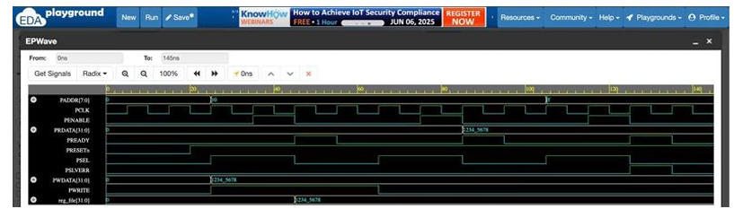

# APB Interface in Verilog

A Verilog implementation and simulation of an AMBA APB interface consisting of an APB master, APB slave, and testbench.

## Overview

This project implements a basic APB communication interface using Verilog HDL. The design includes an APB master module that handles address decoding and transaction control, along with an APB slave module that performs read and write operations using a simple memory block.

The project was simulated using a Verilog testbench to verify reset, write, read, and invalid address operations.

## Features

- APB master and slave implementation
- Address decoding for multiple slave-select ranges
- Read and write operations
- Simple memory-based APB slave
- APB enable and select control
- `PREADY` signal handling
- `PSLVERR` generation for invalid addresses
- Testbench with reset, write, read, and invalid address tests

Add additional test cases
Add waveform screenshots
Extend the slave interface with more realistic register blocks

## Project Structure

```text
apb-interface-verilog/
│
├── README.md
│
├── src/
│   ├── APB_master.v
│   └── APB_slave.v
│
└── tb/
    └── tb_apb.v
```

## Modules

### APB Master

The `APB_master` module:

- Receives address, data, and read/write inputs
- Decodes the input address
- Selects the appropriate slave range
- Controls the transaction using different states
- Generates select and enable signals
- Transfers write data and receives read data

### APB Slave

The `APB_slave` module:

- Receives APB control and data signals
- Supports read and write operations
- Uses a simple 256-location memory block
- Generates `PREADY`
- Returns read data through `PRDATA`
- Generates `PSLVERR` for invalid addresses

### Testbench

The `tb_apb` testbench verifies:

1. Reset operation
2. Write operation
3. Read operation
4. Invalid address access

## Address Mapping

| Slave Select | Address Range |
|---|---|
| SS1 | `0x0000` – `0x003C` |
| SS2 | `0x003D` – `0x0078` |
| SS3 | `0x0079` – `0x008C` |

## Simulation Flow

The testbench performs the following sequence:

```text
Reset
  ↓
Write 0x12345678 to address 0x000A
  ↓
Read data from the slave
  ↓
Test an invalid address
  ↓
Check PSLVERR
```

## Simulation Results

The following waveform shows the simulated APB transaction sequence, including reset, write, read, and invalid address operations.



## Tools

- Verilog HDL
- EDA Playground

## Repository Contents

- `src/APB_master.v` — APB master implementation
- `src/APB_slave.v` — APB slave implementation
- `tb/tb_apb.v` — Simulation testbench

## Future Improvements

- Improve APB timing and handshake handling
- Add additional test cases
- Add waveform screenshots
- Extend the slave interface with more realistic register blocks
